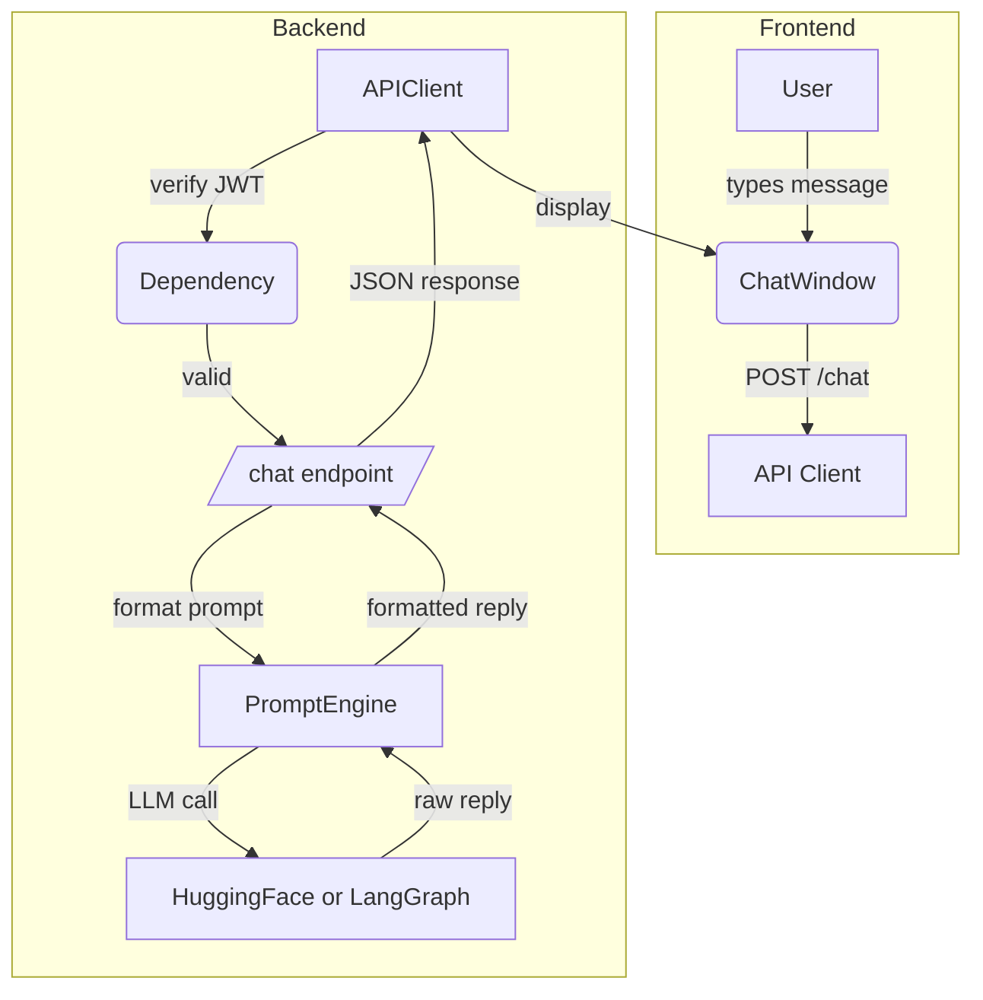

## Simple AI Financial Chat Project

While I was studying Agentic Workflow, I wanted to organize everything I did into a tutorial. So, here it is:

A step-by-step guide for beginners to build a minimal web app where users can ask for a professional-style financial analysis of a stock (e.g., Tesla).

------

### 1. Tech Stack

- **Frontend**: React.js (create‑react‑app)
- **Backend**: FastAPI (Python)
- **LLM Integration**: LangGraph or direct HuggingFace Python client
- **Authentication**: JSON Web Tokens (JWT)

------

### 2. Components & Purpose

1. **Frontend (React)**
   - **Purpose**: Provide a clean, Apple‑style chat interface for users to type questions and see responses.
   - **Key Parts**:
     - Chat window component
     - Input box + send button
     - API service module to call backend
2. **Authentication Module (FastAPI)**
   - **Purpose**: Secure endpoints so only logged‑in users can use the LLM.
   - **Key Parts**:
     - `/login` endpoint (returns JWT on success)
     - Dependency injection to protect `/chat` endpoint
3. **LLM Backend (FastAPI)**
   - **Purpose**: Receive user prompts, forward them to an LLM, and return formatted financial analysis.
   - **Key Parts**:
     - `/chat` endpoint (accepts user message + JWT)
     - `PromptEngine` class to wrap HuggingFace or LangGraph calls
     - Easy hooks for future RAG/MCP: e.g. `PromptEngine.call_tools()` placeholder

------

### 3. Folder Structure

```
project-root/
├── frontend/         # React app
│   ├── src/
│   │   ├── components/
│   │   │   ├── ChatWindow.jsx
│   │   │   └── MessageInput.jsx
│   │   └── api.js   # calls backend
│   └── package.json
└── backend/          # FastAPI app
    ├── app/
    │   ├── main.py       # mount routes
    │   ├── auth.py       # JWT logic
    │   ├── llm_engine.py # PromptEngine class
    │   └── models.py     # Pydantic schemas
    └── requirements.txt
```

------

### 4. Interaction Flow



------

### 5. Step‑by‑Step Setup

1. **Backend**

   - Create a virtualenv and install FastAPI & JWT libs:

     ```bash
     cd backend
     python -m venv venv && source venv/bin/activate
     pip install fastapi uvicorn python‑jose[cryptography] transformers
     ```

   - Define `auth.py` with a `/login` route issuing JWTs.

   - In `llm_engine.py`, wrap a small HF model or LangGraph call:

     ```python
     class PromptEngine:
         def __init__(self):
             # load your model or LangGraph client
             pass
         def generate_report(self, prompt: str) -> str:
             # placeholder for sending to HF or LangGraph
             return modeled_output
     ```

   - In `main.py`, mount `/login` and `/chat` (protected) routes.

   - Run with:

     ```bash
     uvicorn app.main:app --reload
     ```

2. **Frontend**

   - Scaffold React app:

     ```bash
     npx create-react-app frontend
     cd frontend && npm install axios
     ```

   - Build `api.js` to attach JWT to headers and call `/chat`.

   - Create `ChatWindow` and `MessageInput` components that use `api.js`.

   - Run with:

     ```bash
     npm start
     ```

3. **Test the Flow**

   - Hit `/login` with test credentials to get a token.
   - In UI, paste token in a header config or simple prompt.
   - Type `Can you please give me a financial analysis of Tesla?` and see the response.

------

### 6. Future Extensions

- **RAG & MCP Compatibility**: In `PromptEngine`, leave hooks like `def call_tools(self, data): ...` so you can plug in retrieval or custom tools later without changing your API surface.
- **Scaling Up**: Swap HuggingFace local calls for LangGraph orchestration when you’re ready.

------

You now have a clear, minimal tutorial blueprint—just follow the steps, and you’ll have a working AI‑powered financial chat in under an hour!


# 配置 set up

## 在`front_end`中创建React Project


```bash
cd front_end #go to the folder first
npx create-react-app . # '.' means create the project using current folder and use its name 'front_end'
```


In the same folder, install **axios** for api communication to backend

```bash
npm install axios
```


run the React code to see the result in the browser

```bash
npm start
```


## Run `back_end` code

install all dependencies based on requirement.txt

````
pip install -r requirements.txt
````


activate backend server

```bash
uvicorn main:app --reload
```


## 术语

use MCP in langchain

https://langchain-ai.github.io/langgraph/agents/mcp/

Streaming

https://langchain-ai.github.io/langgraph/agents/streaming/#tool-updates

Memory

https://langchain-ai.github.io/langgraph/agents/memory/#short-term-memory


### JWT

after the user is authenticated with username and pwd, JWT generates a token

client (front_end) uses token to make request to server (backend)

Server uses Middleware to verify the token


### Async functions

In the context of backend systems, **synchronous** methods execute sequentially, meaning one task must finish before the next begins, while **asynchronous** methods allow tasks to run concurrently, potentially improving efficiency and responsiveness. 


### react hook

React Hooks are functions that allow functional components to manage state and side effects. 

- `useState`: Manages state within a functional component.

- `useEffect`: Handles side effects like data fetching or DOM manipulation.

- `useContext`: Accesses values from the React context.

- `useRef`: Creates a mutable reference that persists across renders.

  

### Mounted

In React, "**mounted**" refers to the phase when a component is created and inserted into the Document Object Model (DOM). This means the component's virtual representation has been transformed into actual DOM elements, making it visible and interactive on the web page.