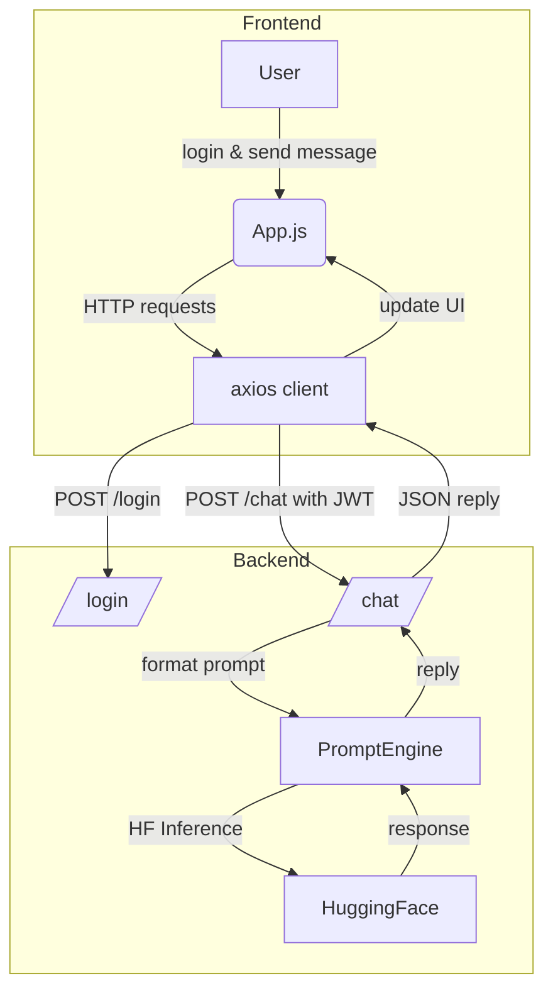

## Simple AI Financial Chat Project

This tutorial explains how to run the sample full‑stack application contained in this repository. The app lets a user log in and request a brief financial report using an LLM hosted on HuggingFace.

------

### 1. Tech Stack

- **Frontend**: React.js (create‑react‑app)
- **Backend**: FastAPI (Python)
- **LLM Integration**: HuggingFace Inference API via LangChain `LLM` wrapper
- **Authentication**: JSON Web Tokens (JWT)

------

### 2. Components & Purpose

1. **Frontend (React)**
   - **Purpose**: Provide a simple chat-style interface for login and messaging.
   - **Key Parts**:
     - `App.js` – handles login form, message list and input box
     - `axios` instance – attaches the JWT and calls the backend
     - Basic styling in `index.css`
2. **Authentication Layer (FastAPI)**
   - **Purpose**: Protect the LLM endpoint so only authenticated users may call it.
   - **Key Parts**:
     - `/login` endpoint (returns a signed JWT on success)
     - Dependency `get_current_user` used by `/chat`
3. **LLM Backend (FastAPI)**
   - **Purpose**: Forward user prompts to a small Llama model and return a concise report.
   - **Key Parts**:
     - `/chat` endpoint (accepts user message + JWT)
     - `PromptEngine` class in `llm_engine.py` using `InferenceClient`

------

### 3. Folder Structure

```
Agent_src/
├── front_end/          # React application
│   ├── src/
│   │   ├── App.js
│   │   ├── index.js
│   │   └── index.css
│   ├── package.json
│   └── ...
└── back_end/           # FastAPI service
    ├── main.py         # API routes and JWT logic
    ├── llm_engine.py   # HuggingFace client wrapper
    └── requirements.txt
```

------

### 4. Interaction Flow



------

### 5. Step‑by‑Step Setup

1. **Backend**

   - Create a virtual environment and install dependencies:

     ```bash
     cd Agent_src/back_end
     python -m venv venv && source venv/bin/activate
     pip install -r requirements.txt
     ```

   - Set the `HF_TOKEN` environment variable for the HuggingFace API.

   - Start the API:

     ```bash
     uvicorn main:app --reload
     ```

2. **Frontend**

   - Install JavaScript packages (includes axios):

     ```bash
     cd ../front_end
     npm install
     ```

   - Run the development server:

     ```bash
     npm start
     ```

3. **Test the Flow**

   - Visit `http://localhost:3000` and log in using the demo credentials `user` / `pwd`.
   - Enter a question like “Give me a short financial analysis of Tesla.”
   - The page will display the model’s response.

------

### 6. Future Extensions

- **RAG/MCP Hooks**: `PromptEngine` can be extended with retrieval or custom tools.
- **Scaling Up**: Swap the small Llama model for LangGraph orchestration or a larger hosted model when ready.

------

The sections below provide a few quick references about concepts used in the project.

## 术语

### JWT

After the user authenticates with a username and password, the backend issues a token. The frontend sends this token in the `Authorization` header when calling `/chat`, and the server verifies it on each request.

### Async functions

In backend systems, *synchronous* methods run sequentially while *asynchronous* methods allow tasks to run concurrently, improving responsiveness.

### React hooks

React Hooks are functions that let functional components manage state and side effects.

- `useState`: Manages component state.
- `useEffect`: Handles side effects like API calls.
- `useContext`: Accesses values from React context.
- `useRef`: Persists a mutable reference across renders.

### Mounted

A React component is **mounted** when it has been created and inserted into the DOM. At this stage it becomes visible and interactive on the page.
